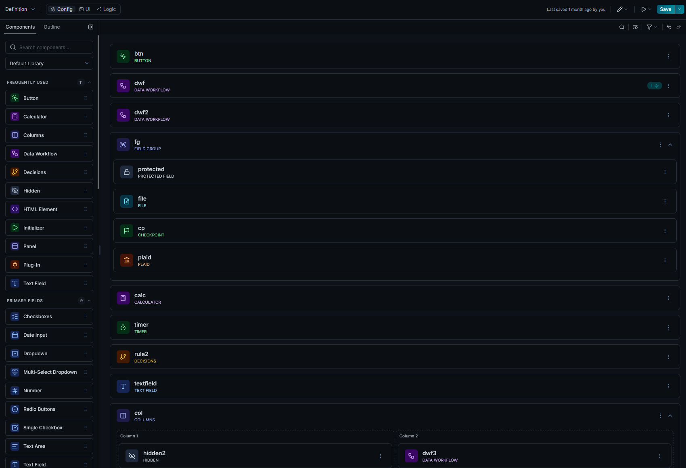
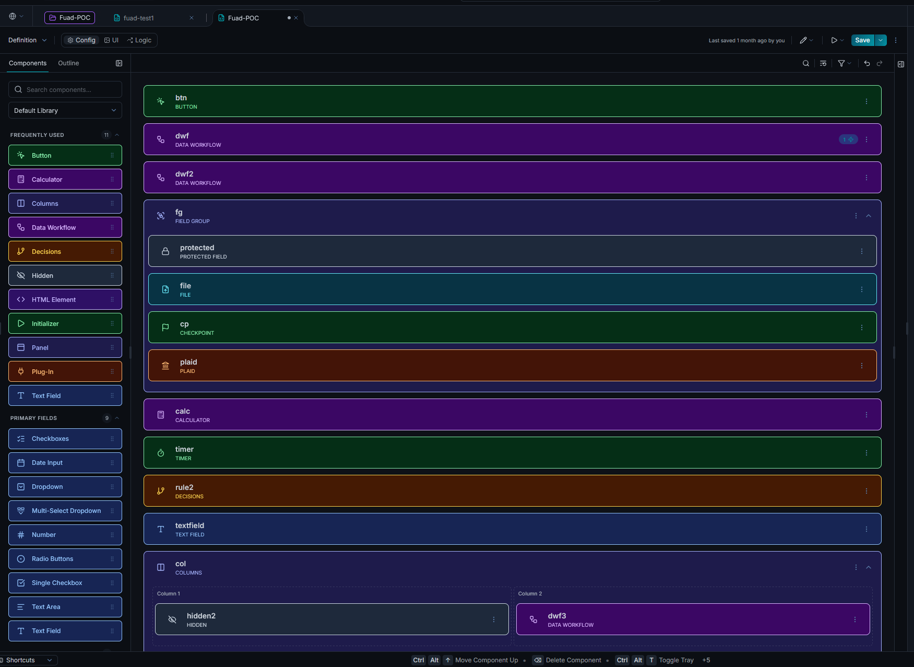
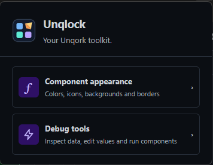
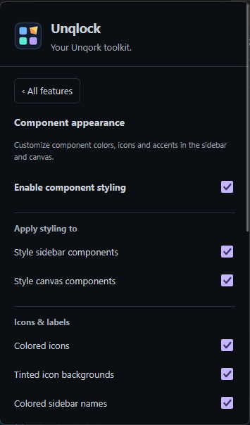
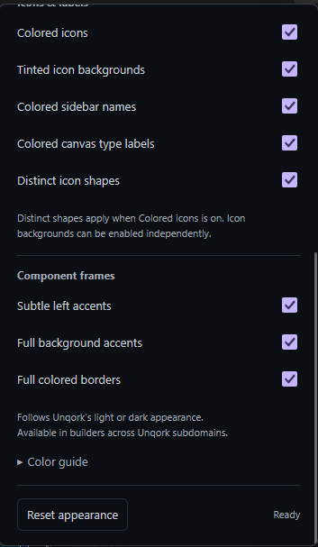
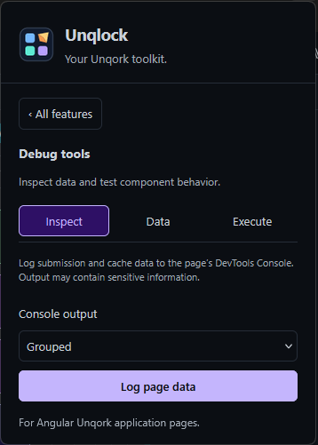
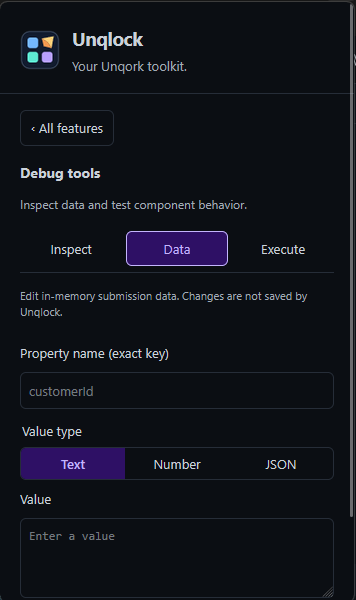
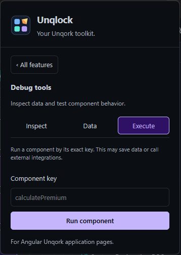

# Unqlock — Chrome and Firefox

Unqlock combines Unqork + Unlock: make builder components easier to recognize.


One source tree, two Manifest V3 builds. Includes all 52 component types, custom icons, light/dark palettes, separate full background/border controls, and support across Unqork subdomains. The current version is recorded in package.json.

## Installation

Requires Chrome 111 or newer, or Firefox desktop 142 or newer.

- Chrome: [Unqlock on the Chrome Web Store](https://chromewebstore.google.com/detail/unqlock/mcjjmjlohiadneoaielnigjjlbibfcja)
- Firefox: [Unqlock on addons.mozilla.org](https://addons.mozilla.org/en-US/firefox/addon/unqlock)

Install from either listing, then refresh any open Unqork tab. Both listings update the extension automatically.

If Firefox has not granted access to your Unqork site, allow it from the extension's permissions controls. Preferences are local to each browser and do not synchronize between Chrome and Firefox. If you previously loaded the unqlock@extensions.local prototype, remove it first to avoid duplicate styling; its saved preferences do not transfer.

## Screenshots

### Builder styling

Colored icons and component type labels:



Full background accents and colored borders:



### Menu and appearance settings

<p>
  
  
  
</p>

### Debug tools

Inspect page data, edit properties, or execute a component:

<p>
  
  
  
</p>

## Popup menu

The popup opens to a feature menu. Choose **Component appearance** for all color, icon, label, accent, background and border controls, the color guide, and reset. Use **All features** or Escape to return to the menu. Existing preferences are preserved; navigation does not toggle the feature.

## Appearance controls

Appearance controls are grouped into master switches, icons/labels, and component frames. **Enable component styling** controls the whole appearance feature; **Style sidebar components** and **Style canvas components** control all effects in their respective areas. They do not affect Debug tools. Individual controls include colored icons, tinted icon backgrounds, colored sidebar names, colored canvas type labels, distinct icon shapes, left accents, full backgrounds and borders. Distinct shapes require colored icons; icon backgrounds are independent. Existing settings retain their behavior: icon colors/backgrounds default on, and the new sidebar-name coloring defaults off. Turning a master off preserves the individual preferences.

## Debug tools

Debug tools uses three keyboard-accessible tabs: **Inspect** for console logging, **Data** for property edits/removal, and **Execute** for component execution. Data values use a Text / Number / JSON selector and monospace editor. Each action reports feedback in its own tab. Mutations and execution require an inline confirmation; Cancel, Escape, editing an input, switching tabs, or leaving the page cancels the pending confirmation. The confirmation applies to a captured request, not later edits. No persistent confirmation checkbox is used.

Open Unqlock from the browser toolbar on an Angular Unqork application page, then choose **Debug tools**. This separately implemented feature follows the workflows observed in Qorkscrew 1.7:

- Log submission and available cache data in the page's DevTools Console, grouped or as a single object. Logs can contain sensitive data.
- Add/update an exact top-level property with text, a finite number, or a JSON object/array. Dots are literal key characters, not nested paths. Reserved prototype keys are rejected.
- Remove an existing property; the value field is ignored.
- Execute one component matching its exact key. Missing, duplicate or non-executable matches are rejected.

Confirm your intent before each edit, removal or execution. Edits affect in-memory submission data only; they do not save submissions or force an Angular digest. Component execution can have external effects, including saving data or calling integrations. Actions target the tab and URL captured when entering Debug tools, and refuse a changed URL. Only one top-level Angular form is supported, not embedded forms or the modern builder. No automatic actions run. Typed values are not persisted. Console output style lasts only for the current popup session.

Debug tools use temporary active-tab access instead of blanket host permissions, including for custom-domain application pages. Real application compatibility and Firefox MAIN-world injection have not yet been verified against a live Unqork page.

## Scope and privacy

Targets the modern Unqork Config builder across HTTPS *.unqork.io subdomains. The script is registered on /ide/* pages so navigation into /ide/builder/ works. Appearance styling does not run on unrelated domains or application pages. Unknown component types are untouched. Legacy canvas, Logic view and UI preview are not supported or verified. Appearance changes do not modify module definitions or submit/save anything.

The full privacy notice is in [docs/PRIVACY.md](docs/PRIVACY.md). Permissions are storage (appearance preferences), activeTab and scripting (user-invoked debug tools). Unqlock makes no external requests or telemetry transmissions; executed application components may do so. Submission/cache data is logged in the page, not returned to extension storage. Firefox explicitly declares no data collection. Full borders replace native border colors while enabled; focus outlines are retained. Disabling or resetting removes decorations. The app's root dark class controls the page palette; the popup follows system appearance.

## Building from source

Requires Node.js 22 or newer and npm. Run both commands from the repository root, the folder containing package.json:

```sh
npm ci
npm run build
```

Outputs:

- dist/chrome/ — unpacked Chrome build.
- dist/firefox/ — unpacked Firefox build.
- artifacts/unqlock-chrome.zip — Chrome package.
- artifacts/unqlock-firefox.zip — unsigned Firefox package.

### Loading a local build

Chrome: open chrome://extensions, enable Developer mode, choose Load unpacked and select dist/chrome. Refresh Unqork. To update an existing manual installation, replace the files in the same folder and click Reload; keeping the path retains its identity and preferences.

Firefox: open about:debugging#/runtime/this-firefox, choose Load Temporary Add-on and select dist/firefox/manifest.json or artifacts/unqlock-firefox.zip. Refresh Unqork. Local builds are unsigned, so Firefox removes them when it restarts; permanent installation needs the signed version from [addons.mozilla.org](https://addons.mozilla.org/en-US/firefox/addon/unqlock).

Tests, versioning and store publishing are documented in [.claude/development.md](.claude/development.md).

## References

- Cross-browser APIs: https://developer.mozilla.org/en-US/docs/Mozilla/Add-ons/WebExtensions/Chrome_incompatibilities
- Firefox no-data declaration: https://extensionworkshop.com/documentation/develop/firefox-builtin-data-consent/
