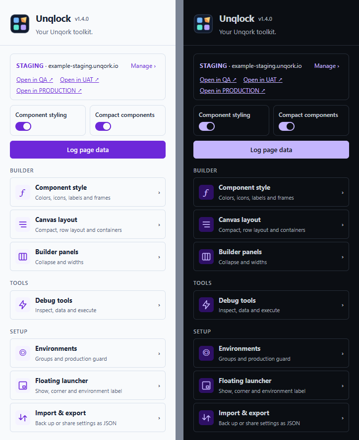
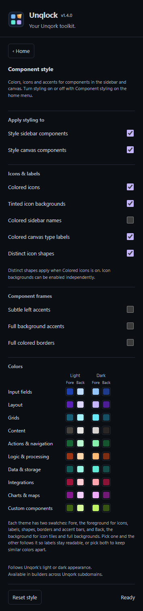
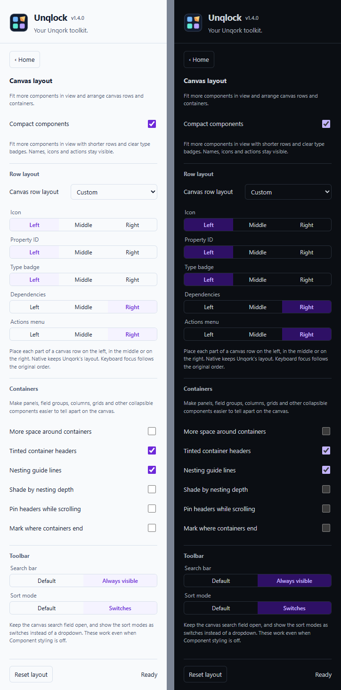
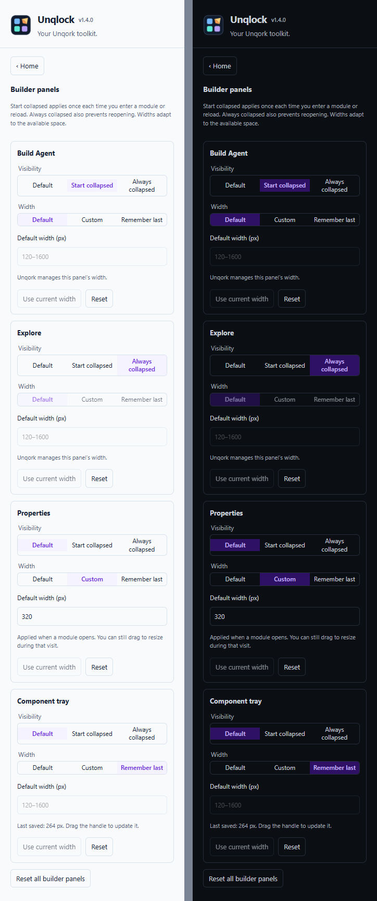
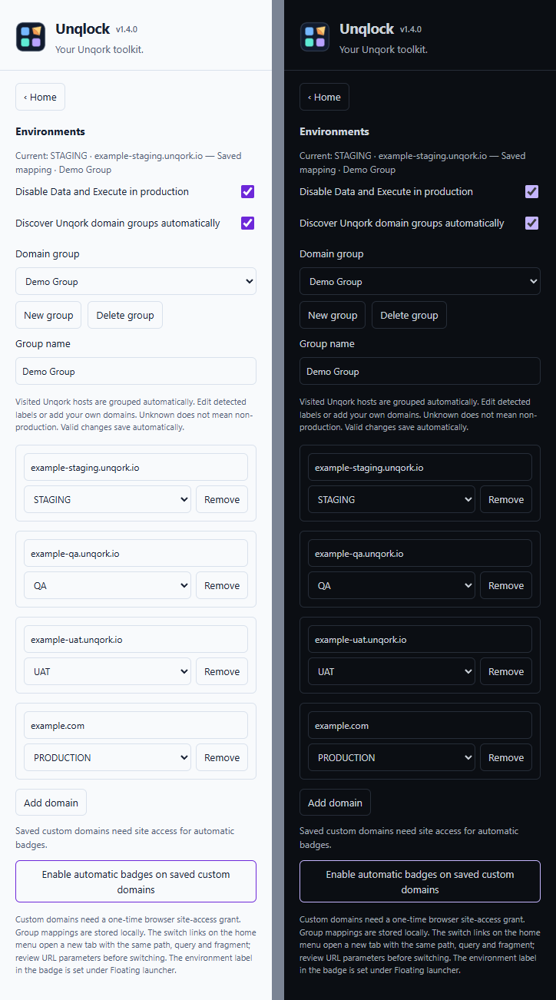
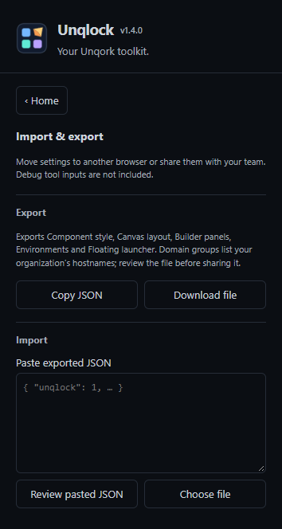

# Unqlock — Chrome and Firefox

Unqlock combines Unqork + Unlock: make builder components easier to recognize.


A Manifest V3 extension for Chrome and Firefox. It styles 54 component types plus custom components with customizable group colors, compacts rows, arranges canvas rows, emphasizes collapsible containers, controls the visibility and width of four builder panels, identifies environments, and adds debug tools for application pages. The current version is recorded in package.json.

## Installation

Requires Chrome 111 or newer, or Firefox desktop 142 or newer.

- Chrome: [Unqlock on the Chrome Web Store](https://chromewebstore.google.com/detail/unqlock/mcjjmjlohiadneoaielnigjjlbibfcja)
- Firefox: [Unqlock on addons.mozilla.org](https://addons.mozilla.org/en-US/firefox/addon/unqlock)

Install from either listing, then refresh any open Unqork tab. Both listings update the extension automatically.

If Firefox has not granted access to your Unqork site, allow it from the extension's permissions controls. Preferences are local to each browser and do not synchronize between Chrome and Firefox.

## Screenshots

### Compact components

Compact rows keep component names, icons and inline type badges visible. The same layout supports subtle accents (left) or full colored backgrounds and borders (right).

<p>
  
  
</p>

### Menu and settings

Every capture shows the light theme on the left and the dark theme on the right; the popup follows your system appearance.

<p>
  
  
  
  
  
  
</p>

### Debug tools

Inspect page data, edit in-memory properties, or execute a component by its key on compatible Angular application pages.

<p>
  
  
  
</p>

The [screenshot guide](docs/screenshots/README.md) lists every capture and the five 1280 × 800 store images.

## Popup menu

The popup opens to a home menu with the everyday actions on top:

- **Environment strip:** the current page's environment and hostname, with **Open in …** links to the same path on the other environments in its group, and **Manage** to edit groups. Pages that are not web pages show *Open an Unqork page to see its environment*.
- **Component styling** and **Compact components** switches, the same preferences as on the feature pages.
- **Log page data**, which logs submission and cache data to the page's DevTools Console using the Console output style from Debug tools. When the page needs site access or is not supported, it opens Debug tools, which explains why and offers the access request.

Below them, features are grouped by where they apply:

- **Builder:** **Component style** (sidebar/canvas scope, icons, labels, frames and group colors), **Canvas layout** (Compact components, canvas row layout, containers and the canvas toolbar) and **Builder panels**.
- **Tools:** **Debug tools**.
- **Setup:** **Environments** (production guard, auto-discovery and domain groups), **Floating launcher** (show, corner and environment label) and **Import & export** (settings as JSON).

Use **‹ Home** or Escape to return; focus goes back to the entry you came from. Component style has **Reset style** and Canvas layout has **Reset layout**; each resets only the settings on its own page. Settings save as you change them, and the page's status reads *Saving…* and then *Saved*.

Choices between a few options, such as the row layout positions, toolbar modes and panel settings, are side-by-side switches you can also move between with the arrow keys. Disabled settings explain why on hover and keyboard focus, such as a setting that needs Component styling or production-blocked Debug tools. Turning a parent setting off keeps the settings that depend on it.

## Canvas layout

**Compact components**, on the home menu and under Canvas layout, fits more components in the sidebar and canvas using shorter rows, smaller icon tiles and inline type badges. Names and actions remain available, and narrow headers wrap their type badge when needed. It follows the sidebar/canvas switches, works independently of color effects, and defaults off.

**Canvas row layout** places each part of a canvas row on the left, in the middle or on the right: the icon, property ID, type badge, dependency count and actions menu. Choose Details right, All left or Details in middle, or Custom to position each part with its own switch. Middle parts sit halfway between the left and right groups; a container's collapse arrow always stays last, and narrow rows wrap. It works with or without Compact components and follows the canvas switch. Native, the default, leaves Unqork's layout untouched, and rows whose structure is not recognized keep it too. Only the visual order changes: keyboard focus follows the original order, and nothing in the module is modified.

**Containers** makes panels, field groups, columns, grids and every other collapsible canvas component easier to tell apart. Containers are recognized by their collapsible structure rather than a type list, so custom collapsible types are included; collapsible areas outside the canvas, such as sidebar categories, are not affected. Each option is a separate toggle, off by default:

- **More space around containers** adds room between containers and a deeper indent for their contents.
- **Tinted container headers** fills each container header with its group's background color and adds a divider, so it reads differently from a regular row. With Full background accents also on, the header keeps a slightly stronger band than its body.
- **Nesting guide lines** draws a category-colored line down the left of each container's contents.
- **Shade by nesting depth** shades container contents a little more at each nesting level.
- **Pin headers while scrolling** keeps a container's header at the top of the canvas while you scroll through it; nested headers stack below their parent.
- **Mark where containers end** adds a small "End of" line with the container's key at the bottom of its contents.

Header effects still apply while a container is collapsed. The options follow the canvas switch.

**Toolbar** controls two buttons on the canvas toolbar. Each one either uses Unqork's **Default** or stays open:

- **Search bar → Always visible** keeps the configuration search field open instead of the search button. It opens without taking focus from what you are editing. The close button and Escape clear the search instead of closing the field; Escape on an empty field moves focus out of it.
- **Sort mode → Switches** replaces the sort dropdown with Default, By Type and Alphabetical side by side, with the current mode highlighted. The switches use Unqork's own sort control and support the arrow keys. Unqork resets the sort mode when the page reloads.

These two options work whether or not Component styling is on. If the builder's sort control is not recognized, Unqork's dropdown stays in place. Reset layout restores the defaults of everything on this page.

## Component style

Component style groups scope, icons and labels, component frames and colors. **Component styling** on the home menu controls the whole appearance feature, including Canvas layout; **Style sidebar components** and **Style canvas components** control all effects in their respective areas. They do not affect Debug tools. Turning a master switch off keeps the individual preferences.

Individual switches cover colored icons, tinted icon backgrounds, colored sidebar names, colored canvas type labels, distinct icon shapes, subtle left accents, full background accents and full colored borders. Colored icons, tinted icon backgrounds, colored canvas type labels and distinct shapes are on by default; the rest are off. Distinct shapes require colored icons; icon backgrounds are independent.

**Colors** lists every component group, such as Input fields, Grids or Logic & processing, with a **Light** and a **Dark** pair of swatches, each a color picker. The first swatch of a pair is the **foreground**, used for icons, labels, shapes, borders and accents; the second is the **background**, used for icon tiles and full background accents. Pick only one and the other is worked out from it so labels stay readable; pick both to keep two similar groups apart, since pale backgrounds of close hues such as red and pink otherwise look alike. **Reset** beside a changed group restores its defaults, and Reset style restores all of them.

## Debug tools

Debug tools has three keyboard-accessible tabs: **Inspect** for console logging, **Data** for property edits and removal, and **Execute** for component execution. Data values use Text, Number or JSON switches and a monospace editor. Each action reports feedback in its own tab. Changes and execution require an inline confirmation; Cancel, Escape, editing an input, switching tabs or leaving the page cancels it. The confirmation applies to the captured request, not later edits.

Open Unqlock on an Angular Unqork application page, then choose **Debug tools**:

- Log submission and available cache data in the page's DevTools Console, grouped or as a single object. Logs can contain sensitive data.
- Add or update an exact top-level property with text, a finite number, or a JSON object or array. Dots are literal key characters, not nested paths. Reserved prototype keys are rejected.
- Remove an existing property; the value field is ignored.
- Execute one component matching its exact key. Missing, duplicate or non-executable matches are rejected.

Edits affect in-memory submission data only; they do not save submissions or force an Angular digest. Component execution can have external effects, including saving data or calling integrations. Actions target the tab and URL captured when entering Debug tools, and refuse a changed URL. Only one top-level Angular form is supported, not embedded forms or the modern builder. No automatic actions run. Typed values are not stored, and the Console output style lasts only while the popup is open.

From the browser toolbar, Debug tools use temporary active-tab access instead of blanket host permissions, including on custom-domain application pages. Opening Unqlock from the floating launcher spends no toolbar click, so Debug tools then offers **Enable debug tools on this site** and requests access for that one hostname when you choose it. Every other page works without that grant. Grants persist until revoked in browser extension settings; you can decline and use the toolbar button instead.

## Builder panels

**Builder panels** configures **Build Agent**, **Explore**, **Properties** and **Component tray** (including Outline) independently; each panel's options are always shown. Under **Visibility**, **Default** keeps Unqork's behavior. **Start collapsed** closes the panel once each time you enter a module or reload; you can open it afterward, and a change takes effect on your next module visit. **Always collapsed** closes it immediately and prevents reopening, including keyboard and resize-handle expansion. Its expand icon remains visible with a hover and focus explanation pointing back to Builder panels.

Under **Width**, choose **Default** for native sizing, **Custom** for a default width in pixels, or **Remember last** to keep your last width. Custom widths apply on module entry and manual expansion; dragging can override the width during that visit. Remembered widths update after a deliberate drag or keyboard resize, not after collapse or a window resize. **Use current width** captures the open panel in the active module as a custom default. Widths are constrained by Unqork's native limits and available canvas space; the saved preference is kept on smaller screens. Widths are inactive while Always collapsed is selected, but their preferences are kept.

Preferences apply across modern builder modules in this browser profile and persist after browser restarts. Each panel has **Reset**, plus **Reset all builder panels** to remove Unqlock's collapse policies and width preferences; native controls resume without forcing panels open. This feature is independent of component styling and does not modify module definitions. If Unqork changes its panel implementation, unavailable default sizing is reported in settings and native dragging remains available.

## Environments and the floating launcher

**Floating launcher** turns the launcher on or off and chooses its **Corner**: top left, top right, bottom left or bottom right. The launcher shows the Unqlock icon; click it to open the same menu as the toolbar button. Browsers that cannot open the toolbar popup directly use a small extension window linked to the original tab. **Show environment in badge** adds the environment label beside the icon; hiding the label does not disable production safeguards.

**Environments**, also reached through **Manage** in the home strip, holds production protection and domain groups. Settings are stored in extension-local storage and persist across page reloads and browser restarts.

Visited HTTPS Unqork hosts are collected into organization groups automatically; only hostnames are saved, not page paths, queries or data. Open Unqork tabs are also checked when the extension is installed or updated. Creator, Express and standard hostname variants are grouped separately. Auto-discovery adds observed hosts only, never invents destinations and never overwrites your edits. You can disable discovery, rename groups, change environment labels, add or remove domains, and create or delete whole groups. Removed auto-discovered hosts may be collected again on a later visit while discovery is on.

Standard staging, QA, UAT, pre-production and production tokens are recognized, including stagingx, uatx and -designer variants. Ambiguous names such as qa-uatx are collected as **UNKNOWN** until you assign their environment. Unknown does not mean safe or non-production. Explicit mappings override inference, and each hostname belongs to one group only.

Production data edits and execution show a red confirmation with Cancel focused by default. **Disable Data and Execute in production** blocks these tools while keeping Inspect available. These safeguards apply only to Unqlock actions, not Unqork's own buttons. Settings changes cancel pending confirmations, and the policy is checked again before execution.

The switch links offer the other domains in the current hostname's group. Each opens a new tab, keeping protocol, port, path, query and fragment. Review URL parameters before switching; module IDs, routes and login state may differ between environments.

Environment edits save automatically when valid; invalid or incomplete entries leave the saved mapping unchanged. For custom domains, enter the group and domains, then choose **Enable automatic badges on saved custom domains**. The browser requests access only to the saved custom hostnames. Once granted, the badge loads automatically after reloads and browser restarts. Denying or revoking access keeps your mappings and production settings. Removing a custom hostname unregisters its automatic badge. Site access can be revoked in the browser's extension settings.

## Import and export

**Import & export** moves settings to another browser or shares them with a team as JSON. **Copy JSON** puts the export on the clipboard and **Download file** saves it as `unqlock-settings-DATE.json`. The export covers Component style, Canvas layout, Builder panels (including remembered widths), Environments and Floating launcher; Debug tools inputs are not included. Domain groups list your organization's hostnames, so review a file before sharing it.

To import, paste the JSON and choose **Review pasted JSON**, or choose **Choose file**. Unqlock validates the whole file before changing anything, then lists the sections it contains. Chosen sections replace the current ones and the rest stay as they are; Cancel or Escape leaves everything unchanged. Imported custom-domain groups need site access before their automatic badges load: open Environments and choose **Enable automatic badges on saved custom domains**. Firefox closes its toolbar popup when a file picker opens, so there **Choose file** continues in a tab. When a page does not allow the floating menu to write to the clipboard, Copy JSON shows the selected JSON to copy by hand.

## Scope and privacy

Unqlock targets the modern Unqork Config builder across HTTPS *.unqork.io subdomains. Its builder scripts are registered on /ide/* pages so navigation into /ide/builder/ works. Appearance styling does not run on unrelated domains or application pages. Unknown component types keep their native colors and icons; compact layout and canvas row layout apply when their header structure is compatible, and container options apply to any collapsible canvas component. Legacy canvas, Logic view and UI preview are not supported. Appearance changes do not modify module definitions or submit or save anything.

The full privacy notice is in [docs/PRIVACY.md](docs/PRIVACY.md). Permissions are storage (preferences and saved domain groups), activeTab (user-invoked tools), scripting (debug tools and automatic badge registration), and optional site access (saved custom domains and, when you enable it, Debug tools from the floating launcher). Automatic badges run on HTTPS *.unqork.io pages. Unqlock makes no telemetry transmissions; environment links navigate to the selected hostname with the kept URL, and executed application components may contact their own services. Submission and cache data is logged in the page, never returned to extension storage. Firefox explicitly declares no data collection. Full borders replace native border colors while enabled; focus outlines are kept. Disabling or resetting removes decorations. The builder's dark class controls the page palette; the popup follows the system appearance.

## Building from source

Requires Node.js 22 or newer and npm. The extension is written in TypeScript and built with [WXT](https://wxt.dev); the popup uses React. Run both commands from the repository root, the folder containing package.json:

```sh
npm ci
npm run build
```

Outputs:

- dist/chrome/ — unpacked Chrome build.
- dist/firefox/ — unpacked Firefox build.
- artifacts/unqlock-chrome.zip — Chrome package.
- artifacts/unqlock-firefox.zip — unsigned Firefox package.

### Loading a local build

Chrome: open chrome://extensions, enable Developer mode, choose Load unpacked and select dist/chrome. Refresh Unqork. To update an existing manual installation, rebuild into the same folder and click Reload; keeping the path keeps its identity and preferences.

Firefox: open about:debugging#/runtime/this-firefox, choose Load Temporary Add-on and select dist/firefox/manifest.json or artifacts/unqlock-firefox.zip. Refresh Unqork. Local builds are unsigned, so Firefox removes them when it restarts; permanent installation needs the signed version from [addons.mozilla.org](https://addons.mozilla.org/en-US/firefox/addon/unqlock).

Tests, versioning and store publishing are documented in [.claude/development.md](.claude/development.md).

## References

- Cross-browser APIs: https://developer.mozilla.org/en-US/docs/Mozilla/Add-ons/WebExtensions/Chrome_incompatibilities
- Firefox no-data declaration: https://extensionworkshop.com/documentation/develop/firefox-builtin-data-consent/
