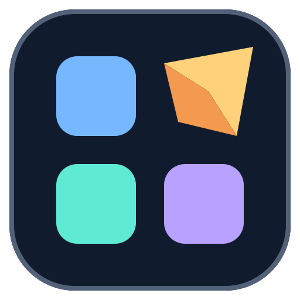
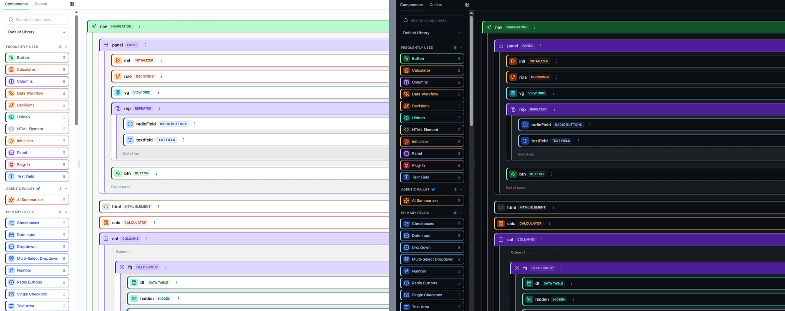
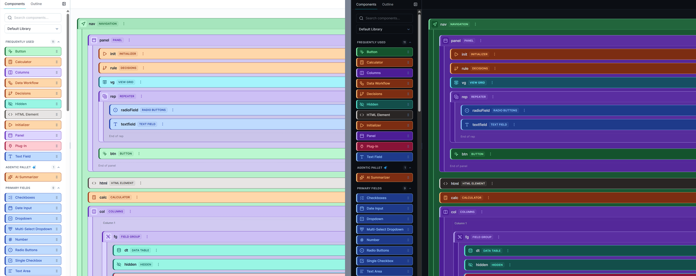
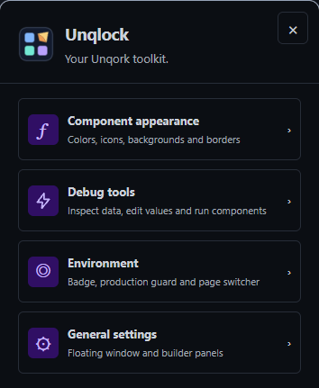
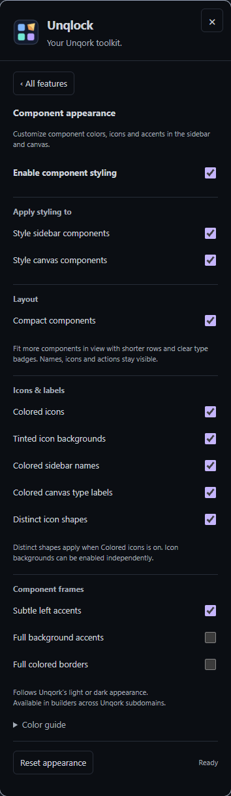
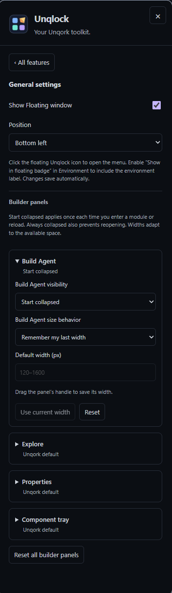
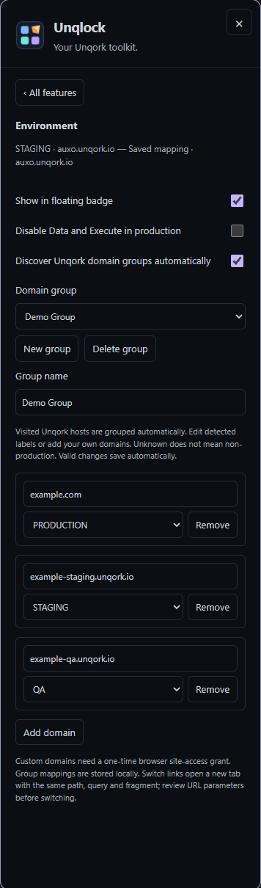
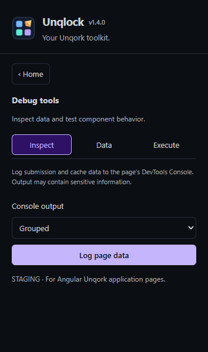
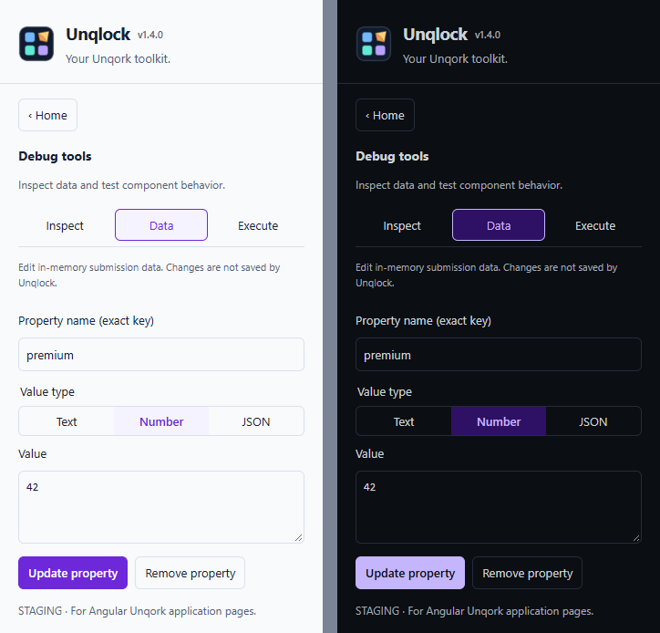
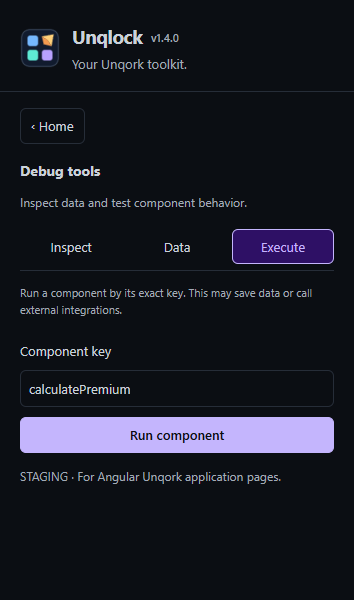

# Unqlock — Chrome and Firefox

Unqlock combines Unqork + Unlock: make builder components easier to recognize.



One source tree, two Manifest V3 builds. Includes styling for 54 component types plus custom components, with customizable group colors, compact rows, configurable canvas row layout, container emphasis for collapsible components, visibility and width controls for four builder panels, environment tools, a floating menu and application debugging. The current version is recorded in package.json.

## Installation

Requires Chrome 111 or newer, or Firefox desktop 142 or newer.

- Chrome: [Unqlock on the Chrome Web Store](https://chromewebstore.google.com/detail/unqlock/mcjjmjlohiadneoaielnigjjlbibfcja)
- Firefox: [Unqlock on addons.mozilla.org](https://addons.mozilla.org/en-US/firefox/addon/unqlock)

Install from either listing, then refresh any open Unqork tab. Both listings update the extension automatically.

If Firefox has not granted access to your Unqork site, allow it from the extension's permissions controls. Preferences are local to each browser and do not synchronize between Chrome and Firefox.

## Screenshots

### Compact components

Compact rows keep component names, icons and inline type badges visible. The same layout supports subtle accents (left) or full colored backgrounds and borders (right).

<p>
  
  
</p>

### Menu and settings

The home menu shows the current environment, the two most used switches and Log page data; each feature has its own page for component style, canvas layout, builder panels, debug tools, environments, the floating launcher and import and export. These captures predate the reorganized home menu, so their headings differ from the current popup.

<p>
  
  
  
  
</p>

### Debug tools

Inspect page data, edit in-memory properties, or execute a component by its key on compatible Angular application pages.

<p>
  
  
  
</p>

These screenshots use the supplied captures at their original resolution; click a linked source in the [screenshot guide](docs/screenshots/README.md) to view it full-size. The five 1280 × 800 store collages and their upload order are also documented there.

## Popup menu

The popup opens to a home menu with the everyday actions on top:

- **Environment strip:** the current page's environment and hostname, with **Open in …** links to the same path on the other environments in its group, and **Manage** to edit groups. Pages that are not web pages show *Open an Unqork page to see its environment*.
- **Component styling** and **Compact components** switches, the same preferences as on the feature pages.
- **Log page data**, which logs submission and cache data to the page's DevTools Console using the Console output style from Debug tools. When the page needs site access or is not supported, it opens Debug tools, which explains why and offers the access request.

Below them, features are grouped by where they apply:

- **Builder:** **Component style** (sidebar/canvas scope, icons, labels, frames and group colors), **Canvas layout** (Compact components, canvas row layout, containers and the canvas toolbar) and **Builder panels**.
- **Tools:** **Debug tools**.
- **Setup:** **Environments** (production guard, auto-discovery and domain groups), **Floating launcher** (show, corner and environment label) and **Import & export** (settings as JSON).

Use **‹ Home** or Escape to return; focus goes back to the entry you came from. Component style has **Reset style** and Canvas layout has **Reset layout**; each resets only the settings on its own page. The reorganization kept every stored preference, so existing settings carry over. Navigation does not toggle any feature.

**Compact components**, on the home menu and under Canvas layout, fits more components in the sidebar and canvas using shorter rows, smaller icon tiles and inline type badges. Names and actions remain available, and narrow headers wrap their type badge when needed. It follows the sidebar/canvas switches, works independently of color effects, and defaults off. Reset layout restores the normal layout.

**Canvas row layout**, also under Canvas layout, places each part of a canvas row on the left, in the middle or on the right: the icon, property ID, type badge, dependency count and actions menu. Choose Details right, All left or Details in middle, or pick a position per part for a custom layout. Middle parts sit halfway between the left and right groups; a container's collapse arrow always stays last, and narrow rows wrap. It works with or without Compact components and follows the canvas switch. Native, the default, leaves Unqork's layout untouched, and rows whose structure is not recognized keep it too. Only the visual order changes: keyboard focus follows the original order, and nothing in the module is modified. Reset layout returns to Native.

**Containers** makes panels, field groups, columns, grids and every other collapsible canvas component easier to tell apart. Containers are recognized by their collapsible structure rather than a type list, so new or custom collapsible types are included; collapsible areas outside the canvas, such as sidebar categories, are not affected. Each option is a separate toggle, off by default:

- **More space around containers** adds room between containers and a deeper indent for their contents.
- **Tinted container headers** fills each container header with its group's background color and adds a divider, so it reads differently from a regular row. With Full background accents also on, the header keeps a slightly stronger band than its body.
- **Nesting guide lines** draws a category-colored line down the left of each container's contents.
- **Shade by nesting depth** shades container contents a little more at each nesting level.
- **Pin headers while scrolling** keeps a container's header at the top of the canvas while you scroll through it; nested headers stack below their parent.
- **Mark where containers end** adds a small "End of" line with the container's key at the bottom of its contents.

Header effects still apply while a container is collapsed. The options follow the canvas switch and are cleared by Reset layout.

**Toolbar**, at the end of Canvas layout, controls two buttons on the canvas toolbar with switches like those for the row layout. Each one either uses Unqork's **Default** or stays open:

- **Search bar → Always visible** keeps the configuration search field open instead of the search button. It opens without taking focus from what you are editing. The close button and Escape clear the search instead of closing the field; Escape on an empty field moves focus out of it.
- **Sort mode → Switches** replaces the sort dropdown with Default, By Type and Alphabetical side by side, with the current mode highlighted. The switches use Unqork's own sort control and support the arrow keys. Unqork still resets the sort mode when the page reloads.

These two options work whether or not Component styling is on, and Reset layout returns both to Unqork's default. If the builder's sort control is not recognized, Unqork's dropdown stays in place.

## Appearance controls

Component style groups scope, icons/labels, component frames and colors. **Colors**, at the end, lists every component group, such as Input fields, Grids or Logic & processing, with a **Light** and a **Dark** pair of swatches, each a color picker. The first swatch of a pair is the **foreground**, used for icons, labels, shapes, borders and accents; the second is the **background**, used for icon tiles and full background accents. Pick only one and the other is worked out from it so labels stay readable; pick both to keep two similar groups apart, since pale backgrounds of close hues such as red and pink otherwise look alike. **Reset** beside a changed group restores its defaults, Reset style restores all of them, and Import & export includes them with Component style. **Component styling** on the home menu controls the whole appearance feature, including Canvas layout; **Style sidebar components** and **Style canvas components** control all effects in their respective areas. They do not affect Debug tools. Individual controls include colored icons, tinted icon backgrounds, colored sidebar names, colored canvas type labels, distinct icon shapes, left accents, full backgrounds and borders. Distinct shapes require colored icons; icon backgrounds are independent. Existing settings retain their behavior: icon colors/backgrounds default on, and the new sidebar-name coloring defaults off. Turning a master off preserves the individual preferences.

## Debug tools

Debug tools uses three keyboard-accessible tabs: **Inspect** for console logging, **Data** for property edits/removal, and **Execute** for component execution. Data values use a Text / Number / JSON selector and monospace editor. Each action reports feedback in its own tab. Mutations and execution require an inline confirmation; Cancel, Escape, editing an input, switching tabs, or leaving the page cancels the pending confirmation. The confirmation applies to a captured request, not later edits. No persistent confirmation checkbox is used.

Open Unqlock from the browser toolbar on an Angular Unqork application page, then choose **Debug tools**. This separately implemented feature follows the workflows observed in Qorkscrew 1.7:

- Log submission and available cache data in the page's DevTools Console, grouped or as a single object. Logs can contain sensitive data.
- Add/update an exact top-level property with text, a finite number, or a JSON object/array. Dots are literal key characters, not nested paths. Reserved prototype keys are rejected.
- Remove an existing property; the value field is ignored.
- Execute one component matching its exact key. Missing, duplicate or non-executable matches are rejected.

Confirm your intent before each edit, removal or execution. Edits affect in-memory submission data only; they do not save submissions or force an Angular digest. Component execution can have external effects, including saving data or calling integrations. Actions target the tab and URL captured when entering Debug tools, and refuse a changed URL. Only one top-level Angular form is supported, not embedded forms or the modern builder. No automatic actions run. Typed values are not persisted. Console output style lasts only for the current popup session.

Debug tools use temporary active-tab access instead of blanket host permissions, including for custom-domain application pages. Opening Unqlock from the floating badge spends no toolbar click, so it cannot use active-tab access; Debug tools then offers **Enable debug tools on this site** and requests access for that one hostname when you choose it. Component style, Canvas layout, Builder panels, Environments, Floating launcher and Import & export need no grant from the badge. Grants persist until revoked in browser extension settings; you can decline and use the toolbar button instead. Real application compatibility and Firefox MAIN-world injection have not yet been verified against a live Unqork page.

## Builder panels

In **Builder panels**, configure **Build Agent**, **Explore**, **Properties**, and **Component tray** (including Outline) independently with switches like those for the canvas row layout. **Default** preserves native behavior. **Start collapsed** closes the panel once each time you enter a module or reload; you can open it afterward. Changing to Start collapsed takes effect on your next module visit. **Always collapsed** closes it immediately and prevents reopening, including keyboard and resize-handle expansion. Its expand icon remains visible with a hover/focus explanation pointing back to Builder panels.

For each panel's width, choose **Default** for native sizing, **Custom** for a default width in pixels, or **Remember last** to keep your last width. Custom widths apply on module entry and manual expansion; dragging can override the width during that visit. Remembered widths update after a deliberate drag or keyboard resize, not after collapse or a window resize. **Use current width** captures the open panel in the active module as a custom default. Widths are constrained by Unqork's native limits and available canvas space; the saved preference is retained on smaller screens. Sizes are inactive while Always collapsed is selected, but their preferences are preserved.

Preferences apply across supported modern builder modules in this browser profile and persist after browser restarts. Each panel has Reset, plus **Reset all builder panels** to remove Unqlock's collapse policies and width preferences. Native controls resume without forcing panels open. This feature is independent of component styling and does not modify module definitions. If Unqork changes its panel implementation, unavailable default sizing is reported in settings and native dragging remains available.

Disabled settings explain their dependencies on hover and keyboard focus, including floating-window position, appearance master switches and production-blocked Debug tools. Turning a parent setting off preserves its dependent preferences.

## Environment badge, guard and switcher

Choose **Floating launcher** to turn **Show floating launcher** on or off and choose its **Corner**: top left, top right, bottom left or bottom right. The floating launcher shows the Unqlock icon by default. Click it to open the same menu as the toolbar button; browsers that cannot open the toolbar popup directly use a small extension window linked to the original tab.

**Show environment in badge**, also under Floating launcher, adds the environment label beside the icon; hiding the label does not disable production safeguards. Choose **Environments**, or **Manage** in the home strip, to manage production protections and domain groups. Settings are stored in extension-local storage and persist across page reloads and browser restarts.

Visited HTTPS Unqork hosts are collected into organization groups automatically; only hostnames are saved, not page paths, queries or data. Existing open Unqork tabs are also checked when the extension is installed or updated. Creator, Express and standard hostname variants are grouped separately. Auto-discovery adds observed hosts only, never invents destinations and never overwrites your edits. You can disable discovery, rename groups, change environment labels, add/remove domains, or create/delete whole groups. Removed auto-discovered hosts may be collected again on a later visit if discovery is enabled.

Standard staging, QA, UAT, pre-production and production tokens are recognized, including stagingx, uatx and -designer variants. Ambiguous names such as qa-uatx are collected as **UNKNOWN** until you assign their environment. Unknown does not mean safe or non-production. Explicit mappings override inference, and each hostname belongs to one group only.

Production data edits and execution show a red confirmation with Cancel focused by default. **Disable Data and Execute in production** blocks these tools while keeping Inspect available. These safeguards apply only to Unqlock actions, not Unqork's own buttons. Settings changes cancel pending confirmations; policy is checked again before execution.

The switcher offers other domains in the current hostname's group. Each opens a new tab, preserving protocol, port, path, query and fragment. Review URL parameters before switching; module IDs, routes and login state may differ between environments.

Environment edits save automatically when valid; invalid or incomplete entries leave the saved mapping unchanged. For custom domains, enter the group and domains, then choose **Enable automatic badges on saved custom domains**. The browser requests access only to the saved custom hostnames. Once granted, the badge loads automatically after reloads and browser restarts. Denying or revoking access preserves your mappings and production settings. Removing a custom hostname unregisters its automatic badge. Site access can be revoked in the browser's extension settings. Badge visibility and guards are independent of appearance settings.

## Import and export

**Import & export**, under Setup, moves settings to another browser or shares them with a team as JSON. **Copy JSON** puts the export on the clipboard and **Download file** saves it as `unqlock-settings-DATE.json`. The export covers Component style, Canvas layout, Builder panels (including remembered widths), Environments and Floating launcher; Debug tools inputs are not included. Domain groups list your organization's hostnames, so review a file before sharing it.

To import, paste the JSON and choose **Review pasted JSON**, or choose **Choose file**. Unqlock validates the whole file before changing anything, then lists the sections it contains. Chosen sections replace the current ones and the rest stay as they are; Cancel or Escape leaves everything unchanged. Imported custom-domain groups need site access before their automatic badges load: open Environments and choose **Enable automatic badges on saved custom domains**. Firefox closes its toolbar popup when a file picker opens, so there **Choose file** continues in a tab. When a page does not allow the floating menu to write to the clipboard, Copy JSON shows the selected JSON to copy by hand.

## Scope and privacy

Targets the modern Unqork Config builder across HTTPS *.unqork.io subdomains. The script is registered on /ide/* pages so navigation into /ide/builder/ works. Appearance styling does not run on unrelated domains or application pages. Unknown component types keep their native colors and icons; compact layout and canvas row layout can apply when their header structure is compatible, and container options apply to any collapsible canvas component. Legacy canvas, Logic view and UI preview are not supported or verified. Appearance changes do not modify module definitions or submit/save anything.

The full privacy notice is in [docs/PRIVACY.md](docs/PRIVACY.md). Permissions are storage (appearance, floating-menu, environment and builder-panel preferences), activeTab (user-invoked tools), scripting (debug tools and automatic badge registration), and optional site access (saved custom domains only). Automatic badge access covers HTTPS *.unqork.io pages. Unqlock makes no telemetry transmissions; environment links navigate to the selected hostname with the preserved URL; executed application components may do so. Submission/cache data is logged in the page, not returned to extension storage. Firefox explicitly declares no data collection. Full borders replace native border colors while enabled; focus outlines are retained. Disabling or resetting removes decorations. The app's root dark class controls the page palette; the popup follows system appearance.

## Building from source

Requires Node.js 22 or newer and npm. Run both commands from the repository root, the folder containing package.json:

```sh
npm ci
npm run build
```

Outputs:

- dist/chrome/ — unpacked Chrome build.
- dist/firefox/ — unpacked Firefox build.
- artifacts/unqlock-chrome.zip — Chrome package.
- artifacts/unqlock-firefox.zip — unsigned Firefox package.

### Loading a local build

Chrome: open chrome://extensions, enable Developer mode, choose Load unpacked and select dist/chrome. Refresh Unqork. To update an existing manual installation, replace the files in the same folder and click Reload; keeping the path retains its identity and preferences.

Firefox: open about:debugging#/runtime/this-firefox, choose Load Temporary Add-on and select dist/firefox/manifest.json or artifacts/unqlock-firefox.zip. Refresh Unqork. Local builds are unsigned, so Firefox removes them when it restarts; permanent installation needs the signed version from [addons.mozilla.org](https://addons.mozilla.org/en-US/firefox/addon/unqlock).

Tests, versioning and store publishing are documented in [.claude/development.md](.claude/development.md).

## References

- Cross-browser APIs: https://developer.mozilla.org/en-US/docs/Mozilla/Add-ons/WebExtensions/Chrome_incompatibilities
- Firefox no-data declaration: https://extensionworkshop.com/documentation/develop/firefox-builtin-data-consent/
